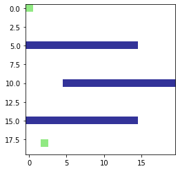

# Algorithme de pathfinding en Python 

### Description :

Petit algorithme qui trouve le chemin le plus court entre deux points (A et B) sur une map avec des murs. Pour ce projet j'ai utilisé les librairies numpy et matplotlib. Il a été initialement créé sur un notebook .ipynb, puis transféré en fichier .py normal, ce qui le rend un peu moins agréable à lire. 

### Le projet se décompose en trois parties :

- Algorithme de pathfinding avec des boucles
- Test de notre algorithme avec des points aléatoires qui ne sont pas des murs
- Algorithme de pathfining avec des récurrences

### Images d'exemple

##### Map avec les points A et B et les murs :

##### Chemin le plus court entre A et B :

